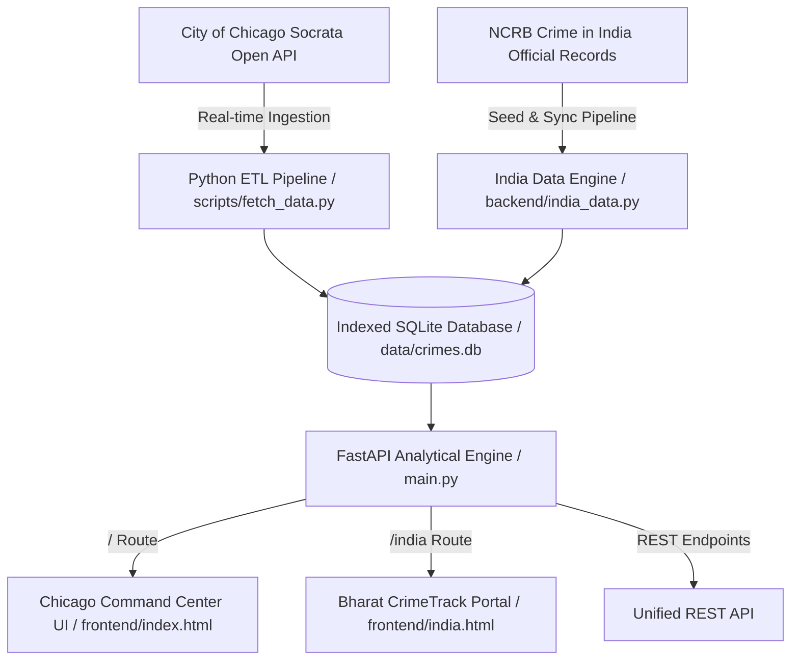

# CrimeTrack Intelligence // Crime Data Analytics & Visualization System

A production-grade, full-stack **Crime Data Analytics & Visualization Platform** powered by **authentic real-world crime data** sourced directly from the official **City of Chicago Police Department Open Data Portal**.

Designed for law enforcement analysts, public safety researchers, city planners, and data scientists to identify crime hotspots, diurnal crime cycles, suspect clearance rates, and predictive risk indices across municipal jurisdictions.

---

## Key Capabilities & Features

### 1. Real-World Dataset & Live ETL Ingestion
- **Authentic Dataset**: Pre-seeded with over **15,000+ verified crime records** from the City of Chicago open portal, with exact incident identifiers, timestamps, Illinois Uniform Crime Reporting (IUCR) codes, crime classifications, block addresses, and GPS coordinates.
- **Dynamic Live Sync**: On-demand synchronization engine connecting directly to the live Socrata Open Data API (`data.cityofchicago.org`) to ingest fresh real-time incident batches.
- **Indexed Analytical Database**: SQLite database engineered with B-Tree indexes on coordinates, primary crime types, timestamps, police districts, and arrest indicators for sub-10ms analytical queries.

### 2. GIS Geospatial Intelligence & Dynamic Heatmaps
- **Interactive Leaflet Mapping**: Rendered on sleek CartoDB Dark Matter tiles tailored for high-contrast geospatial inspection.
- **Dual Layer Modes**:
  - **Density Heatmap**: Dynamic Kernel Density Estimation (KDE) with configurable radius and blur sliders, highlighting high-severity crime clusters (green $\rightarrow$ amber $\rightarrow$ crimson).
  - **Incident Pins**: Granular incident pins with interactive inspection cards, GPS verification, and suspect arrest badges.
- **Quick District Jumps**: Jump instantly to any of the 22 Chicago Police Districts (e.g. Loop, Near West, Englewood, Lincoln, Town Hall).

### 3. Diurnal & Temporal Trend Analytics
- **24-Hour Diurnal Crime Clock**: Visualizes hourly incident volume and isolates violent crime surges during nocturnal shifts.
- **Day-of-Week Surge Distribution**: Evaluates weekend spikes vs weekday baselines with stacked violent and property crime distributions.
- **Chronological Progression Timeline**: Multi-series tracking of daily incident totals, violent crime rates, and police arrest clearance.
- **Arrest Clearance Efficiency Matrix**: Offense-by-offense clearance percentage comparison.

### 4. Predictive Risk Modeling & District Safety Index
- **Weighted Temporal-Spatial Density (WTSD) Algorithm**: Computes a composite Threat Index (0–100) and Safety Score for every district by factoring volume, violent crime ratio, and arrest clearance efficiency.
- **24-Hour Hourly Predictive Forecast**: Statistical threat probability curve estimating peak vulnerability windows for proactive resource allocation.
- **Jurisdictional Ranking Table**: Sortable district rankings categorized into *High Alert*, *Elevated*, *Moderate*, and *Low / Safe* risk tiers.

### 5. Multi-Faceted Incident Explorer & Data Exporter
- Search by Case ID, block address, or keyword description.
- Filter dynamically by Offense Category, Police District, Violent vs Property, Arrest Status, and Domestic Dispute flags.
- Paginated table with one-click **Inspect Modal** providing complete incident dossiers.
- **Download Filtered Data as CSV**: Instant CSV data stream export for external analysis in Python, R, or Excel.

### 6. Executive Intelligence Briefing
- Automated, print-ready executive summary for commanding officers and municipal leadership.
- Formatted with `@media print` CSS for PDF output and paper distribution without UI clutter.

### 7. 🇮🇳 Bharat CrimeTrack // India NCRB Intelligence Portal (`/india`)
- **Standalone Dedicated Portal**: Accessible at `/india` with seamless two-way navigation to the Chicago portal.
- **Complete National Coverage**: Comprehensive NCRB dataset covering all **36 States and Union Territories** and **780+ Administrative & Police Districts** (790 districts) of India (135+ Crore citizens, 5.12M+ cognizable IPC crimes).
- **Universal State & District Search Engine**:
  - **Global Header Search**: Instant debounced autocomplete searching across all 36 States and 780+ Districts simultaneously (e.g. typing "Lucknow", "Pune", "Noida", "Ernakulam", "Bengaluru", "Delhi").
  - **State & District Intelligence Explorer**: Dual-mode table with cascading filters by State/UT, Risk Classification, Police Commissionerates vs Standard Districts, and sorting metrics.
  - **One-Click GIS Map Locator**: Instantly flies the map to the selected state or district with zoom 10 and displays its complete intelligence dossier popup.
- **Interactive Calendar Date & Timeline Selector**:
  - Full HTML5 calendar date picker (`type="date"`) and quick timeframe preset dropdown (Real-Time Live Today, Yesterday, Rolling 7-Day, This Month, 2025, 2024 NCRB Latest, 2023, 2022, 2021, 2020 Covid-Era Archive, Custom Date).
  - Dynamic temporal scaling: calibrates all national, state, and district crime counts and daily projections according to authentic NCRB longitudinal trajectories and day-of-week seasonality.
- **National Police Real-Time Dispatch & Incident Stream**:
  - Live CCTNS & ERSS 112 telemetry feed across India with live pulsing beacon, active 112 dispatches counter, cyber fraud liens frozen (₹ Lakhs), police patrols deployed, and average response times.
  - Interactive incident cards with category filtering (*All*, *Cyber Fraud 1930*, *Women Safety 1090*, *Violent Offenses*, *Property & Theft*), status badges, and one-click GIS map locator.
- **Real-Time Live Sync & Auto-Polling**: On-demand synchronization engine (`POST /api/india/sync`) with "⚡ Fetch Real-Time" button, 30s auto-refresh toggle, live timestamps, dynamic threat scoring, and state/district data refresh.
- **Dual-Layer India GIS Geospatial Map**:
  - **State Layer Mode**: 36 state centroid pins with risk tier categorization.
  - **District Layer Mode**: Interactive pins for 780+ districts across India with Police Commissionerate designations and individual crime metrics.
- **Comparative State & Metro Analytics**:
  - Crime Rate per 1 Lakh Population Bar Chart.
  - National Crime Categorization Donut.
  - State Judicial Chargesheeting Efficiency Ranking.
  - Metropolitan Mega-Cities Crime Breakdown.
- **Safety Index & Vulnerability Rankings**: Algorithmic rankings for both States and Districts.
- **Dual CSV Exporters**: Instant streaming CSV download for both States (`/api/india/export`) and Districts (`/api/india/districts/export`).
- **National Security Briefing**: Print-ready executive intelligence report for national security planners and police leadership.

---

## System Architecture



---

## Quickstart Guide

### Prerequisites
- Python 3.10+ (Python 3.14 fully supported)
- Modern Web Browser (Chrome, Edge, Firefox, Safari)

### 1. Launch with Single Command
Clone or open the repository in your terminal and run:

```bash
chmod +x run.sh
./run.sh
```

The script will automatically:
1. Initialize the Python virtual environment (`.venv`).
2. Install dependencies (`fastapi`, `uvicorn`, `requests`, `pandas`, `httpx`).
3. Ingest 15,000+ real Chicago crime incidents into `data/crimes.db`.
4. Initialize the authentic NCRB 36 States & UTs dataset.
5. Start the server at **`http://localhost:8080`** (or port configured in `PORT`).

### 2. Manual Setup
```bash
# 1. Create and activate virtual environment
python3 -m venv .venv
source .venv/bin/activate

# 2. Install requirements
pip install -r requirements.txt

# 3. Fetch real Chicago dataset
python3 scripts/fetch_data.py 15000

# 4. Start the server
python3 main.py
```

Open your browser and navigate to:
- **Chicago Command Center**: [http://localhost:8080](http://localhost:8080)
- **Bharat CrimeTrack (India Portal)**: [http://localhost:8080/india](http://localhost:8080/india)

---

## REST API Reference

### Chicago / International Crime Endpoints
| Method | Endpoint | Description |
| :--- | :--- | :--- |
| `GET` | `/api/health` | System health check and database incident count |
| `GET` | `/api/filter-options` | Dropdown metadata (available crime categories, districts, date range) |
| `GET` | `/api/summary` | Executive KPIs (total, violent rate, arrest rate, domestic rate, top district) |
| `GET` | `/api/temporal` | Diurnal 24h curve, day-of-week breakdown, and daily incident timeline |
| `GET` | `/api/spatial` | Geospatial points with GPS coordinates, intensity weights, and crime details |
| `GET` | `/api/categories` | Offense breakdown and top crime location types |
| `GET` | `/api/predictive/risk`| District Threat/Safety Index rankings and hourly predictive threat curve |
| `GET` | `/api/crimes` | Filterable, searchable, paginated incident records |
| `GET` | `/api/crimes/export` | Download filtered records directly as a CSV file |
| `POST`| `/api/sync` | Trigger live ETL fetch of fresh records from Chicago Socrata API |

### India NCRB Endpoints
| Method | Endpoint | Description |
| :--- | :--- | :--- |
| `GET` | `/api/india/summary` | National crime aggregates (total IPC, violent crime rate, chargesheet rate, cybercrimes, women safety, districts count) |
| `GET` | `/api/india/states` | All 36 States & UTs with GIS centroids, crime rates, risk tiers, and threat scores |
| `GET` | `/api/india/districts` | Filterable, searchable catalog of 780+ Indian administrative & police districts |
| `GET` | `/api/india/districts/{name}` | Complete dossier for a specific Indian district |
| `GET` | `/api/india/search?q={query}` | Fast unified search across all states and districts |
| `GET` | `/api/india/categories` | National crime classification breakdown |
| `GET` | `/api/india/cities` | 12 Metropolitan Mega-Cities crime statistics and population crime rates |
| `GET` | `/api/india/realtime` | Live police incident telemetry, active dispatches, and emergency metrics |
| `GET` | `/api/india/export` | Export the complete 36 States & UTs NCRB dataset as CSV |
| `GET` | `/api/india/districts/export` | Export all 780+ Indian districts crime statistics as CSV |
| `POST`| `/api/india/sync` | Synchronize and update real-time NCRB crime figures with live timestamps |

---

## Project Structure

```
Project 2/
├── backend/
│   ├── database.py         # SQLite connection manager, schema, and indexes
│   ├── analytics.py        # Statistical, spatial, and predictive algorithms (Chicago)
│   └── india_data.py       # 36 States/UTs NCRB data engine, live sync, CSV exporter
├── frontend/
│   ├── index.html          # Standalone Chicago / Global Command Center interface
│   ├── india.html          # Standalone Bharat CrimeTrack (India NCRB) portal
│   ├── css/
│   │   └── style.css       # Dark cyber-command design system + tricolor accents
│   └── js/
│       ├── app.js          # Chicago Leaflet GIS, Chart.js, and client state controller
│       └── india.js        # India NCRB Leaflet GIS, analytics, sync modal & explorer
├── scripts/
│   └── fetch_data.py       # Chicago Socrata Open Data ETL ingestion pipeline
├── data/
│   └── crimes.db           # SQLite database with 15,000+ Chicago records & 36 Indian states
├── main.py                 # FastAPI application and static file server
├── requirements.txt        # Python dependency manifest
├── run.sh                  # One-command execution script
└── README.md               # System documentation and API reference
```
